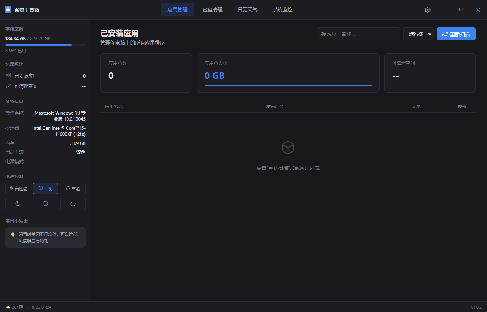

# 系统工具箱

一个 Windows 桌面端系统清理管理工具，绿色便携，开箱即用。

## 功能

- **应用管理**：查看已安装应用，一键卸载
- **磁盘清理**：清理临时文件、注册表残留、回收站等
- **日历天气**：IP自动定位，显示实时天气
- **系统监控**：CPU、内存、磁盘、网络实时监控
- **电源模式切换**：一键切换平衡/高性能/节能模式
- **系统托盘**：关闭行为自选（最小化到托盘/直接退出）
- **内置更新检测**：启动自动检测新版本

## 下载

[前往发行版下载最新版](https://gitee.com/pzzy77/system-toolbox/releases

## 使用说明

- 绿色便携版，解压即可使用
- **升级方式**：将新版本exe放到旧版本同一目录替换旧exe即可，**请勿删除整个文件夹**，data文件夹会自动保留配置
- 首次启动会在同目录生成data文件夹，用于存储配置和扫描记录

## 开发者

Pzzy20

## 更新日志

[查看完整更新日志](https://gitee.com/pzzy77/system-toolbox/releases